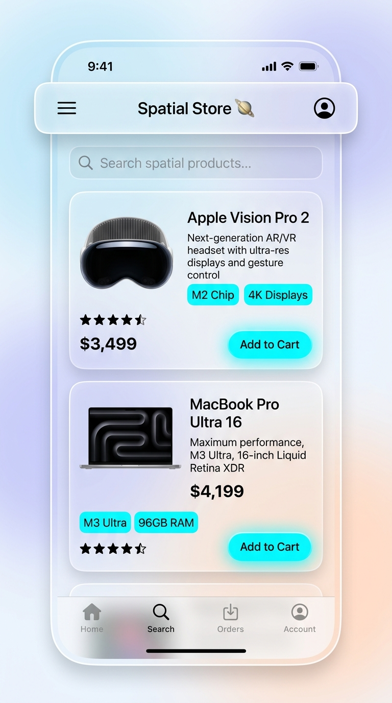
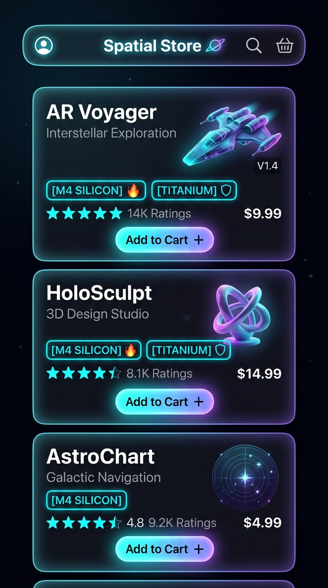
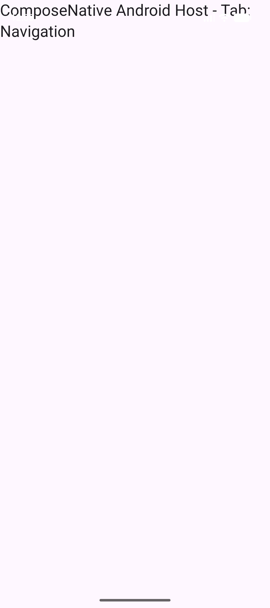
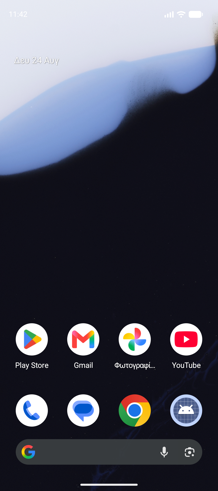

# ComposeNativeSwift 🚀

> **Translate Kotlin Multiplatform Compose UI into 100% Genuine Native SwiftUI Views on iOS with Zero Friction.**

[](https://kotlinlang.org)
[](https://developer.apple.com/swift/)
[](https://developer.apple.com/xcode/swiftui/)
[](https://github.com/stavris8894/ComposeNativeSwift/actions/workflows/ci.yml)
[](https://github.com/stavris8894/ComposeNativeSwift/releases)
[](LICENSE)

---

## 🌟 Overview

Unlike standard Compose Multiplatform (which draws on a canvas via Skiko/OpenGL), **ComposeNativeSwift** translates your Compose UI hierarchy directly into **100% genuine native SwiftUI views**:

- 📱 **True Native Views**: `Text` ➔ `SwiftUI.Text`, `Button` ➔ `SwiftUI.Button`, `TextField` ➔ `SwiftUI.TextField` (with iOS autocorrect, secure text entry, and system keyboards).
- ⚡ **Zero Canvas Overhead**: Fluid 120 FPS ProMotion animations with native battery efficiency.
- ♿ **Native iOS Accessibility**: VoiceOver and Dynamic Type work automatically.
- 🌓 **Material 3 & Dark Theme**: Built-in `CNTheme` engine that automatically adapts between Light and Dark mode.
- 🌫️ **Native Glassmorphism & Materials**: Apple UltraThin/Thin materials and blur vibrancy.
- 📳 **Haptic Feedback Engine**: Native `UIImpactFeedbackGenerator` & `UINotificationFeedbackGenerator` triggers.
- 🎯 **1 Line of SwiftUI**: Render any shared screen with `ComposeNativeView(screen: MyScreen())`.

---

## 📸 Screenshots

<div align="center">

### 🍏 iOS (Genuine SwiftUI + Liquid Glass Navigation)

| Light Mode (Liquid Glass) | Dark Mode (Liquid Glass) |
| :---: | :---: |
|  |  |

### 🤖 Android (Material 3 + Jetpack Compose)

| Light Mode (Material 3) | Dark Mode (Material 3) |
| :---: | :---: |
|  |  |

</div>

---

## 📦 Installation

### 1. Kotlin Multiplatform (`build.gradle.kts`)

Add the dependency to your shared module:

```kotlin
repositories {
    mavenCentral()
}

kotlin {
    // Export framework for iOS
    listOf(
        iosX64(),
        iosArm64(),
        iosSimulatorArm64()
    ).forEach { iosTarget ->
        iosTarget.binaries.framework {
            baseName = "SharedApp"
            isStatic = true
            export("com.composenative.swift:compose-native-core:1.0.0")
        }
    }

    sourceSets {
        commonMain.dependencies {
            api("com.composenative.swift:compose-native-core:1.0.0")
        }
    }
}
```

### 2. iOS App (Swift Package Manager)

In Xcode, go to **File > Add Package Dependencies...** and enter:

```
https://github.com/stavris8894/ComposeNativeSwift.git
```

Or add it to your `Package.swift`:

```swift
dependencies: [
    .package(url: "https://github.com/stavris8894/ComposeNativeSwift.git", from: "1.0.0")
]
```

---

## 🚀 Quick Start & ViewModel Architecture

### 1. Define Business Logic & State in Kotlin (`commonMain`)

Keep 100% of your state and business logic in a `CNViewModel`:

```kotlin
package com.example.shared.viewmodels

import com.composenative.swift.core.CNViewModel

class CounterViewModel : CNViewModel() {
    var count by mutableStateOf(0)
    var step by mutableStateOf(1)

    fun increment() { count += step }
    fun decrement() { count -= step }
    fun reset() { count = 0 }
}
```

### 2. Build the Screen (`commonMain`)

Subclass `CNScreenWithViewModel` and write familiar Compose declarative UI:

```kotlin
package com.example.shared

import com.example.shared.viewmodels.CounterViewModel
import com.composenative.swift.components.*
import com.composenative.swift.core.*

class CounterScreen(
    viewModel: CounterViewModel = CounterViewModel()
) : CNScreenWithViewModel<CounterViewModel>(viewModel) {

    override fun build(): CNNode = Scaffold(
        topBar = TopAppBar(title = "ComposeNative Counter"),
        content = Column(
            modifier = Modifier.fillMaxSize().padding(20.dp),
            verticalArrangement = Arrangement.spacedBy(16.dp),
            horizontalAlignment = Alignment.CenterHorizontally
        ) {
            add(
                Text(
                    text = "Count: ${viewModel.count}",
                    style = TextStyle(fontSize = 32.sp, fontWeight = FontWeight.Bold),
                    color = if (viewModel.count >= 0) CNColor.Primary else CNColor.Error
                )
            )
            add(
                Row(
                    modifier = Modifier.fillMaxWidth(),
                    horizontalArrangement = Arrangement.spacedBy(12.dp)
                ) {
                    add(
                        Button(
                            onClick = { viewModel.decrement() },
                            modifier = Modifier.weight(1f).height(48.dp).haptic(CNHapticType.Light)
                        ) {
                            Text("Decrement")
                        }
                    )
                    add(
                        Button(
                            onClick = { viewModel.increment() },
                            modifier = Modifier.weight(1f).height(48.dp).haptic(CNHapticType.Light)
                        ) {
                            Text("Increment")
                        }
                    )
                }
            )
        }
    )
}
```

### 3. Display in SwiftUI (`iOS App`)

Swift code is kept to an absolute minimum — just **1 line of SwiftUI**:

```swift
import SwiftUI
import ComposeNativeSwift
import SharedApp

struct ContentView: View {
    var body: some View {
        ComposeNativeView(screen: CounterScreen())
    }
}
```

All state mutations in Kotlin `CNViewModel` automatically notify SwiftUI to re-render genuine native views reactively!

---

## 🧭 Multi-Screen Navigation & Liquid Glass

ComposeNativeSwift provides full Compose Navigation DSL that renders into SwiftUI `NavigationStack` with **Liquid Glass navigation bars & frosted specular materials**:

```kotlin
class StoreScreen : CNScreen() {
    val navController = rememberNavController()

    override fun build(): CNNode = NavHost(
        navController = navController,
        startDestination = "catalog"
    ) {
        composable(
            route = "catalog",
            title = "Spatial Store 🪐",
            navBarStyle = CNNavBarStyle.LiquidGlass
        ) {
            Button(
                onClick = { navController.navigate("details") },
                modifier = Modifier.liquidGlass(blurRadius = 24.dp, cornerRadius = 18.dp)
            ) {
                Text("View Product Details ➔")
            }
        }

        composable(
            route = "details",
            title = "Device Specs",
            navBarStyle = CNNavBarStyle.LiquidGlass
        ) {
            Button(
                onClick = { navController.popBackStack() },
                modifier = Modifier.liquidGlass()
            ) {
                Text("Back to Store")
            }
        }
    }
}
```

---

## 🧩 Component Catalog

ComposeNativeSwift supports all core Compose UI & Material 3 components:

| Category | Kotlin Multiplatform API | SwiftUI Native Mapping |
| :--- | :--- | :--- |
| **Layouts** | `Column`, `Row`, `Box`, `FlowRow`, `FlowColumn`, `Spacer`, `Divider` | `VStack`, `HStack`, `ZStack`, wrap layouts, native dividers |
| **Typography** | `Text(text, style, maxLines)` | `SwiftUI.Text` with font weights, line limits, and dynamic colors |
| **Buttons** | `Button`, `OutlinedButton`, `IconButton`, `ExtendedFloatingActionButton` | `SwiftUI.Button` with native styles and tactile feedback |
| **Inputs** | `TextField`, `OutlinedTextField`, `Switch`, `Slider`, `RangeSlider` | `SwiftUI.TextField`, `Toggle`, `Slider`, dual-thumb range slider |
| **Pickers & Steppers** | `DatePicker`, `TimePicker`, `Stepper`, `RatingBar` | `SwiftUI.DatePicker`, `Stepper`, custom star rating bar |
| **Menus & Context** | `DropdownMenu`, `DropdownMenuItem` | `SwiftUI.Menu` with native icons, destructive items, and actions |
| **Search & Pagers** | `SearchBar`, `HorizontalPager`, `VerticalPager` | `SwiftUI.searchable`, `TabView(.page)` carousel |
| **Selection** | `FilterChip`, `AssistChip`, `SegmentedButtonRow`, `RadioButton` | SwiftUI Capsule Chips, `Picker(.segmented)`, Radio Groups |
| **Lists & Grids** | `LazyColumn`, `LazyRow`, `LazyVerticalGrid`, `ListItem` | `ScrollView + LazyVStack / LazyVGrid`, Grouped Cells |
| **Navigation** | `Scaffold`, `TopAppBar`, `TabRow`, `NavigationBar` | `NavigationStack`, Navigation Title, TabBar |
| **Containers** | `Card`, `Surface`, `Accordion`, `Banner` | Rounded card elevation, `DisclosureGroup`, Notification banners |
| **Feedback** | `Snackbar`, `CircularProgressIndicator`, `LinearProgressIndicator`, `Badge`, `AlertDialog`, `ModalBottomSheet` | Floating toast banner, `ProgressView`, Badge Capsule, `.alert()`, `.sheet()` |

---

## 🌓 Theme & Dark Mode

ComposeNativeSwift includes full Material 3 ColorScheme support:

```kotlin
// Define theme in Kotlin
val lightColors = lightColorScheme(
    primary = CNColor.fromHex("#007AFF"),
    secondary = CNColor.fromHex("#5856D6"),
    surface = CNColor.White
)

val darkColors = darkColorScheme(
    primary = CNColor.fromHex("#0A84FF"),
    secondary = CNColor.fromHex("#5E5CE6"),
    surface = CNColor.fromHex("#1C1C1E")
)
```

In SwiftUI, theme colors seamlessly adapt to the iOS system appearance or explicit dark mode overrides:

```swift
ComposeNativeView(screen: MyScreen())
    .preferredColorScheme(isDarkMode ? .dark : .light)
```

---

## 🎨 Modifier Reference

ComposeNativeSwift modifiers use familiar Compose syntax:

```kotlin
Modifier
    .fillMaxWidth()
    .height(52.dp)
    .padding(horizontal = 16.dp, vertical = 8.dp)
    .background(CNColor.Primary, CNShape.RoundedCorner(12.dp))
    .material(CNMaterialType.UltraThin, CNShape.RoundedCorner(12.dp)) // Glassmorphism
    .blur(radius = 4.dp)
    .haptic(CNHapticType.Medium)
    .shadow(elevation = 4.dp)
    .clickable { /* handle tap */ }
```

- **Sizing**: `fillMaxWidth()`, `fillMaxHeight()`, `fillMaxSize()`, `width(dp)`, `height(dp)`, `size(dp)`, `aspectRatio(ratio)`, `weight(fraction)`
- **Spacing**: `padding(all)`, `padding(horizontal, vertical)`, `padding(start, top, end, bottom)`
- **Styling & Materials**: `background(color, shape)`, `material(type, shape)`, `blur(radius)`, `clip(shape)`, `cornerRadius(radius)`, `border(width, color)`, `shadow(elevation)`
- **Interactivity & Feedback**: `clickable { ... }`, `haptic(type)`, `refreshable { ... }`, `searchable(query, onQueryChange)`, `alpha(opacity)`, `offset(x, y)`

---

## 🛠️ Repository & Testing

```bash
# Clone the repository
git clone https://github.com/stavris8894/ComposeNativeSwift.git
cd ComposeNativeSwift

# Run JVM & Android check
./gradlew check

# Run Swift Package tests
cd swift-package && swift test

# Build iOS multi-architecture XCFramework
./gradlew :compose-native-core:assembleComposeNativeCoreReleaseXCFramework
```

---

## 📄 License

```
Copyright 2026 ComposeNativeSwift Contributors

Licensed under the Apache License, Version 2.0 (the "License");
you may not use this file except in compliance with the License.
You may obtain a copy of the License at

    http://www.apache.org/licenses/LICENSE-2.0
```
